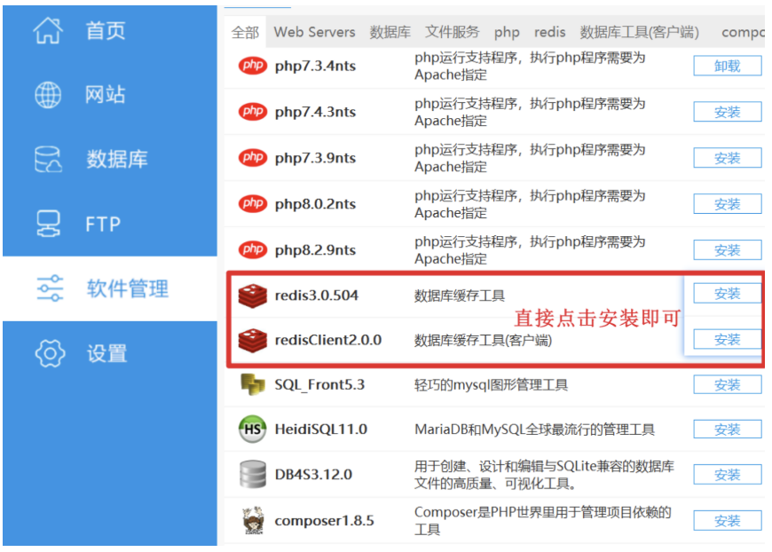
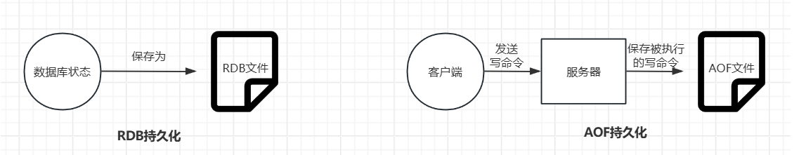

# Redis非关系型数据库

# 一、Redis 概述

## 1 什么是 Redis

Redis（Remote Dictionary Server）是一个开源的、基于内存的键值对存储数据库，它可以用作数据库、缓存和消息中间件。

## 2 Redis 的特点

- **基于内存运行**：数据主要存储在内存中，读写性能极高
- **支持数据持久化**：可以将内存中的数据保存到磁盘，重启后可以再次加载使用
- **丰富的数据类型**：支持字符串（strings）、哈希（hashes）、列表（lists）、集合（sets）、有序集合（sorted sets）等
- **支持事务**：操作都是原子性，要么全部执行，要么全部不执行
- **丰富的特性**：支持发布/订阅、键过期等特性

## 3 Redis 的应用场景

- **缓存系统**：减轻数据库压力，提升系统性能
- **计数器**：如网站访问量、点赞数等
- **消息队列**：利用列表类型实现简单的消息队列
- **排行榜**：利用有序集合实现各种排行榜功能
- **会话存储**：存储用户会话信息

# 二、Redis 软件安装

## 1 Windows 系统安装

### ☆ 方法一：使用小皮工具(推荐)



### ☆ 方法二：使用官方版本

1. 访问 Redis 官网下载 Windows 版本
2. 解压到指定目录，如 `D:\Redis`
3. 打开命令提示符，进入 Redis 目录
4. 运行命令：`redis-server.exe redis.windows.conf`

## 2 MacOS 系统安装

Homebrew是MacOS上的一个包管理器，它可以让安装和管理软件变得非常简单。首先，你需要安装Homebrew（如果你还没有安装的话）。

打开终端，然后粘贴以下命令来安装：

```powershell
# 安装 Homebrew（如果尚未安装）
/bin/bash -c "$(curl -fsSL https://raw.githubusercontent.com/Homebrew/install/HEAD/install.sh)"

# 安装 Redis
brew install redis

# 启动 Redis（后台运行）
brew services start redis

# 或手动启动
redis-server /usr/local/etc/redis.conf

# 检查是否运行
# 在另一个终端窗口中，你可以使用以下命令来检查Redis服务器是否正在运行：
redis-cli ping  # 应返回 PONG,表示Redis服务器正在正常运行。
```

## 3 Linux 系统安装

### ☆ Ubuntu/Debian系统

```powershell
# 更新软件包列表
sudo apt update

# 安装 Redis
sudo apt install redis-server

# 启动 Redis 服务
sudo systemctl start redis-server

# 设置开机自启
sudo systemctl enable redis-server

# 检查 Redis 状态
sudo systemctl status redis-server
```

### ☆ CentOS/RHEL 系统

```powershell
# 安装 EPEL 仓库
sudo yum install epel-release

# 安装 Redis
sudo yum install redis

# 启动 Redis 服务
sudo systemctl start redis

# 设置开机自启
sudo systemctl enable redis
```

## 4 验证安装

安装完成后，可以通过以下命令测试 Redis 是否正常工作：

```powershell
# 连接 Redis 客户端
redis-cli

# 在 Redis 客户端中测试
127.0.0.1:6379> ping
PONG
127.0.0.1:6379> set test "Hello Redis"
OK
127.0.0.1:6379> get test
"Hello Redis"
127.0.0.1:6379> exit
```

---

注意事项说明：

① WSL安装EduRAG环境，这个时候小伙伴要注意，WSL默认使用的yml（忠山）给大家的，Redis是没有密码。

② 如果是基于Vmware配置EduRAG环境，这个时候小伙伴要注意，Vmware中为了安全起见，我设置了Redis密码为123456。

如果没有密码，则`redis-cli -h 192.168.12.xxx`，登录完成后，不需要验证密码，可以直接使用，也有的版本拥有密码，是`1234`，所以大家要自己验证一下。

如果Redis有密码，则`redis-cli -h 192.168.88.100`，登录完成后，需要手工验证密码，命令`auth 123456`,验证后才可以正常使用！

---

# 三、Python Redis模块安装

## 1 使用 pip 安装

```
# 安装 redis-py
pip install redis
```

## 2 使用 uv 安装

```
uv pip install redis
```

## 3 验证安装

**上述两者都指向同一个 Python 库**：`redis-py` 库在导入时都是 `import redis`

安装完成后，可以在 Python 中验证是否安装成功：

```powershell
import redis
print(redis.__version__)
```

# 四、redis模块使用

## 1、Python连接Redis

```python
# 1. 导包
import redis
# 2. 添加异常处理
try:
    # 3. 创建redis对象
    redis_client = redis.StrictRedis(
        host="192.168.88.100",
        port=6379,
        db=0,
        password="123456",
        # Redis获取数据默认以字节方式返回，此处设置为字符串方式返回
        decode_responses=True
    )
    # 4. 连接Redis并测试连通性
    redis_client.ping()  # pong
except redis.RedisError as e:
    # 5. 如果执行失败，则抛出异常
    print(f"Redis连接异常：{e}")
    raise

```

## 2、Python Redis设置字符串类型的数据

```python
# 1. 导包
import redis

# 2. 创建连接
try:
    redis_client = redis.StrictRedis(
        host="192.168.88.100",
        port=6379,
        db=0,
        password="123456",
        # Redis获取数据默认以字节方式返回，此处设置为字符串方式返回
        decode_responses=True
    )
    redis_client.ping()
except redis.RedisError as e:
    print(f"Redis连接异常：{e}")
    raise

# 3. 设置缓存信息
try:
    # 设置缓存信息（不过期）
    redis_client.set("name", "edurag")
    redis_client.set("age", 23)
    # 设置缓存信息（指定过期时间）,ex代表过期时间，单位为秒
    redis_client.set("sex", "male", ex=20)
    print(f"Redis设置数据成功！")
except redis.RedisError as e:
    print(f"Redis操作异常：{e}")
    raise
```

## 3、Python Redis获取字符串类型的数据

```python
# 1. 导包
import redis

# 2. 创建连接
try:
    redis_client = redis.StrictRedis(
        host="192.168.88.100",
        port=6379,
        db=0,
        password="123456",
        # Redis获取数据默认以字节方式返回，此处设置为字符串方式返回
        decode_responses=True
    )
    redis_client.ping()
except redis.RedisError as e:
    print(f"Redis连接异常：{e}")
    raise

# 3. 获取Redis中缓存的数据
try:
    # get(key)
    name = redis_client.get("name")
    age = redis_client.get("age")
    print(name, age)
except redis.RedisError as e:
    print(f"Redis操作异常：{e}")
    raise
```

## 4、JSON模块使用

```python
'''
什么是JSON？
答：
① JSON是一种通用的数据传输格式，一般用于接口开发，前后端分离时数据传输格式。
② JSON结构类似Python中的字典结构，本质是一个字符串，还有一点要特别注意 => JSON中的只能使用双引号
基本语法：
    json_str = '{"question":"Python中列表和元组区别？", "answer":"列表是可变数据类型，元组是不可变数据类型"}'
Python代码中，有一个json的模块，可以实现json字符串转字典，也可以实现字典转json格式字符串
相关函数：
① import json
② 字典 转 json字符串 => json.dumps(字典变量)
③ json字符串 转 字典 => json.loads(json字符串变量)
'''
# 1. 导包
import json

# 2. 定义一个字典
dict_data = {"question":"Python中列表和元组区别？", "answer":"列表是可变数据类型，元组是不可变数据类型"}

# 3. 字典转json字符串
json_str = json.dumps(dict_data, ensure_ascii=False)
print(json_str)
print(type(json_str))

print('-' * 80)

# 4. json字符串转换为字典
dict_data = json.loads(json_str)
print(dict_data)
print(type(dict_data))
```

## 5、Python Redis设置字典类型数据到Redis

name:"itheima", age:23

在生产环境中，往往要设置的字符串比较复杂，可能是一个字典类型的数据

key => 'user:1'

value => '{"name":"itheima", "age":23, "sex":"male"}'

```python
# 1. 导包
import redis
import json

# 2. 创建连接
try:
    redis_client = redis.StrictRedis(
        host="192.168.88.100",
        port=6379,
        db=0,
        password="123456",
        # Redis获取数据默认以字节方式返回，此处设置为字符串方式返回
        decode_responses=True
    )
    redis_client.ping()
except redis.RedisError as e:
    print(f"Redis连接异常：{e}")
    raise

# 3. 设置缓存信息
try:
    # 设置缓存信息（不过期）
    key = "user:1"
    value = {"name":"itheima", "age":23, "sex":"male"}
    redis_client.set(key, json.dumps(value, ensure_ascii=False))
except redis.RedisError as e:
    print(f"Redis操作异常：{e}")
    raise
```

## 6、Python Redis获取字典类型数据到Redis

```python
# 1. 导包
import redis
import json

# 2. 创建连接
try:
    redis_client = redis.StrictRedis(
        host="192.168.88.100",
        port=6379,
        db=0,
        password="123456",
        # Redis获取数据默认以字节方式返回，此处设置为字符串方式返回
        decode_responses=True
    )
    redis_client.ping()
except redis.RedisError as e:
    print(f"Redis连接异常：{e}")
    raise

# 3. 获取Redis中缓存的数据（json格式字符串）
try:
    # 3.1 获取json格式字符串
    data = redis_client.get("user:1")
    # 3.2 json字符串转字典
    dict_data = json.loads(data)
    print(f"姓名：{dict_data['name']}")
    print(f"年龄：{dict_data['age']}")
    print(f"性别：{dict_data['sex']}")
except redis.RedisError as e:
    print(f"Redis操作异常：{e}")
    raise
```

# 五、Redis持久化技术（面试）

## 1、什么是Redis持久化？

Redis作为一个键值对数据库服务器，它保存的数据需要存储到内存中以维护数据的持久性，而实现持久化策略主要由RDB与AOF两种，本文旨在介绍RDB与AOF的底层持久化原理

> 总结：所谓的Redis持久化，就是把Redis内存中的数据在一定条件下转移到磁盘中。目前支持两种持久化技术：RDB快照持久化 与 AOF命令持久化操作

## 2、RDB持久化与AOF持久化技术



RDB快照持久化：保持Redis状态（全量数据保存）

AOF（Append Only File）：保存不是Redis中的数据，而是对Redis的写命令（如set命令等等）

---

RDB触发条件：redis.conf（默认规则）

save 时间间隔（单位s）多少次写操作（添加、修改、删除）

```powershell
save 900 1
save 300 10
save 60 10000
```

这表示如果 900 秒内有至少 1 次修改，或者 300 秒内有至少 10 次修改，或者 60 秒内有至少 10000 次修改，则触发快照。

---

AOF触发条件：redis.conf，增量追加

set name itheima

set age 23

```powershell
appendonly yes  # 开启AOF持久化
appendfilename "appendonly.aof"  # 持久化以后数据保存到appendonly.aof文件

触发条件：
everysec：每s备份一次（推荐）
always：每写入1次自动触发一次
no：完全依赖操作系统进行备份
```

---

RDB命令与AOF命令都可以对数据库数据进行持久化，略有不同的是，RDB文件保存的是数据库的最终数据，并且一般来说计算机内部保存的都是经过压缩的二进制RDB文件，而AOF文件保存的时数据库的执行语句，可以说，RDB持久化关注的是最后的数据库状态，而AOF持久化关注的是服务器执行的具体命令。

有两个Redis命令可以生成RDB文件，分别为`SAVE`与`BGSAVE`，SAVE命令会阻塞Redis服务器进程，知道RDB文件创建完毕，而BGSAVE在执行过程中会派生出一个子进程，由子进程负责创建RDB文件，服务器进程（父进程）继续处理命令请求。

> SAVE：阻塞型备份，如果数据量比较大，会阻塞用户对Redis的写操作。

> BGSAVE：B（BackGroud）后台备份，不会阻塞前台操作，比较适合RDB全量备份操作。

SAVE，BGSAVE两个命令实现，但是两者又略有不同：

SAVE：同步备份Redis数据库状态，会阻塞Redis，其他用户必须等待SAVE完成后才能继续操作。（服务器中要禁止使用SAVE命令）

BGSAVE：异步备份Redis数据库状态，不会阻塞Redis，备份的同时可以执行其他操作。

## 3、RDB和AOF文件加载顺序

在Redis服务器启动时，服务器会自动加载当前目录中的RDB文件，而不需要用户手动载入RDB文件，而AOF文件由于更新频率比RDB高（由于执行语句一直在运行），那么如果服务器开启了AOF持久化功能，服务器会优先使用AOF文件来还原数据库状态。


