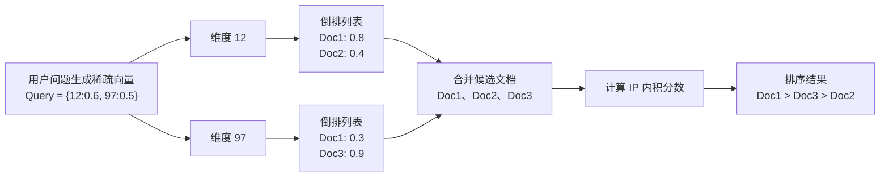

# SPARSE_INVERTED_INDEX倒排索引

## 一、学习目标

学完本节后，学生需要掌握以下内容：

1. 理解什么是稀疏向量。
2. 理解 `SPARSE_INVERTED_INDEX` 为什么叫“稀疏倒排索引”。
3. 能看懂“维度 → 文档”的倒排结构。
4. 能理解 Milvus 为什么使用 `IP` 计算稀疏向量相似度。
5. 能写出 Milvus 中创建 `SPARSE_INVERTED_INDEX` 的基本代码。
6. 能区分稠密向量索引和稀疏向量索引的应用场景。

---

## 二、先理解：什么是稀疏向量？

在 RAG 系统中，向量通常分为两类：

| 类型 | 示例 | 特点 |
|---|---|---|
| 稠密向量 | `[0.12, -0.03, 0.88, 0.21, ...]` | 每个位置通常都有值 |
| 稀疏向量 | `{12: 0.8, 97: 0.3, 1205: 0.6}` | 大部分位置都是 0，只保存非零位置 |

稀疏向量可以理解为：

```text
只记录“哪些维度有值”，以及“这些维度的权重是多少”。
```

例如：

```python
sparse_vector = {12: 0.8, 97: 0.3, 1205: 0.6}
```

含义是：

```text
第 12 维的权重是 0.8
第 97 维的权重是 0.3
第 1205 维的权重是 0.6
其他维度都是 0，不需要存储
```

如果总维度是 250002，但是只有 3 个维度有值，那么它就是一个典型的稀疏向量。

---

## 三、一句话理解 SPARSE_INVERTED_INDEX

`SPARSE_INVERTED_INDEX` 可以理解为：

> 专门给稀疏向量建立的倒排索引。  
> 它不是按照“文档找维度”，而是按照“维度找文档”。

也就是说：

```text
普通存储方式：文档 → 维度
倒排索引方式：维度 → 文档
```

这和传统搜索引擎中的倒排索引很像。

传统搜索引擎中：

```text
关键词“Python” → 出现过 Python 的文档列表
关键词“Milvus” → 出现过 Milvus 的文档列表
```

稀疏向量倒排索引中：

```text
维度 12 → 第 12 维有值的文档列表
维度 97 → 第 97 维有值的文档列表
```

---

## 四、图解：从文档到倒排索引

假设现在有 3 个文档，它们的稀疏向量如下：

```python
Doc1 = {12: 0.8, 97: 0.3, 1205: 0.6}
Doc2 = {12: 0.4, 88: 0.7}
Doc3 = {97: 0.9, 1205: 0.2}
```

### 1. 原始结构：文档 → 维度

```text
Doc1  →  12:0.8     97:0.3     1205:0.6
Doc2  →  12:0.4     88:0.7
Doc3  →  97:0.9     1205:0.2
```

这种结构适合插入数据，但是不适合快速检索。

如果用户查询中出现了第 97 维，系统如果没有索引，就需要逐个扫描 Doc1、Doc2、Doc3，看谁包含第 97 维。

---

### 2. 倒排结构：维度 → 文档

建立 `SPARSE_INVERTED_INDEX` 之后，结构会变成：

```text
维度 12    →   Doc1:0.8     Doc2:0.4
维度 88    →   Doc2:0.7
维度 97    →   Doc1:0.3     Doc3:0.9
维度 1205  →   Doc1:0.6     Doc3:0.2
```

这就是倒排索引。

核心思想是：

```text
原来：拿文档找维度
现在：拿维度找文档
```

---

## 五、Mermaid 图解

如果 Markdown 编辑器支持 Mermaid，可以直接显示下面的图。



---

## 六、查询过程图解

假设用户输入一个问题，模型生成的稀疏查询向量是：

```python
Query = {12: 0.6, 97: 0.5}
```

表示查询问题只在两个维度上有值：

```text
第 12 维权重是 0.6
第 97 维权重是 0.5
```

Milvus 查询时，只需要查这两个维度对应的倒排列表。

### 第一步：查维度 12

```text
维度 12 → Doc1:0.8, Doc2:0.4
```

说明 Doc1 和 Doc2 都在第 12 维上有值。

### 第二步：查维度 97

```text
维度 97 → Doc1:0.3, Doc3:0.9
```

说明 Doc1 和 Doc3 都在第 97 维上有值。

### 第三步：合并候选文档

```text
候选文档：Doc1、Doc2、Doc3
```

### 第四步：计算相似度分数

稀疏向量检索常用 `IP`，也就是 Inner Product，中文叫“内积”。

计算公式：

```text
IP 分数 = 查询维度权重 × 文档维度权重，然后求和
```

---

## 七、手工计算 IP 分数

查询向量：

```python
Query = {12: 0.6, 97: 0.5}
```

文档向量：

```python
Doc1 = {12: 0.8, 97: 0.3, 1205: 0.6}
Doc2 = {12: 0.4, 88: 0.7}
Doc3 = {97: 0.9, 1205: 0.2}
```

### 1. Doc1 得分

Doc1 同时命中了维度 12 和维度 97。

```text
Doc1 = 0.6 × 0.8 + 0.5 × 0.3
     = 0.48 + 0.15
     = 0.63
```

### 2. Doc2 得分

Doc2 只命中了维度 12。

```text
Doc2 = 0.6 × 0.4
     = 0.24
```

### 3. Doc3 得分

Doc3 只命中了维度 97。

```text
Doc3 = 0.5 × 0.9
     = 0.45
```

### 4. 最终排序

```text
Doc1：0.63   第一名
Doc3：0.45   第二名
Doc2：0.24   第三名
```

所以最终检索结果是：

```text
Doc1 > Doc3 > Doc2
```

---

## 八、为什么稀疏倒排索引速度快？

因为稀疏向量大部分位置都是 0。

假设一个稀疏向量总共有 250002 维，但是只有 3 个非零值：

```text
总维度：250002
非零维度：3
零值维度：249999
```

如果暴力扫描，就会浪费大量时间在 0 上。

```text
0, 0, 0, 0, 0, 0, 0, 0, 0, 0, ...
```

`SPARSE_INVERTED_INDEX` 的做法是：

```text
只关注非零维度
只查命中的倒排列表
只计算候选文档
```

所以它比逐个扫描文档更高效。

---

## 九、和稠密向量索引的区别

| 对比项 | 稠密向量索引 | 稀疏倒排索引 |
|---|---|---|
| 典型索引 | HNSW、IVF_FLAT、FLAT | SPARSE_INVERTED_INDEX |
| 数据格式 | `[0.12, -0.03, 0.88, ...]` | `{12:0.8, 97:0.3}` |
| 大多数维度 | 都有值 | 大多数是 0 |
| 检索逻辑 | 找语义空间中距离近的点 | 找共享非零维度的文档 |
| 更擅长 | 语义相似 | 关键词、术语、实体、代码名、型号 |
| RAG 中作用 | 理解语义 | 补充精确匹配能力 |

举例：

```text
用户问：BGE-M3 稀疏向量怎么存？
```

稠密向量可能能找到语义相近的内容。

稀疏向量更容易命中：

```text
BGE-M3
稀疏向量
sparse_vector
SPARSE_INVERTED_INDEX
```

所以在 RAG 系统中，稠密向量和稀疏向量经常配合使用，也就是混合检索。

---

## 十、Milvus 创建 SPARSE_INVERTED_INDEX 示例

下面代码以你的实验环境为例：

```text
Milvus 地址：192.168.88.100:19530
数据库名：milvus_demo
集合名：sparse_demo_collection
```

### 1. 完整代码

```python
from pymilvus import MilvusClient, DataType

# 1. 连接 Milvus
MILVUS_URI = "http://192.168.88.100:19530"
DB_NAME = "milvus_demo"
COLLECTION_NAME = "sparse_demo_collection"

client = MilvusClient(uri=MILVUS_URI)
client.use_database(db_name=DB_NAME)

# 如果集合已存在，先删除，方便重复运行演示
if client.has_collection(collection_name=COLLECTION_NAME):
    client.drop_collection(collection_name=COLLECTION_NAME)

# 2. 创建 Schema
schema = client.create_schema(
    auto_id=False,
    enable_dynamic_field=True
)

schema.add_field(
    field_name="id",
    datatype=DataType.INT64,
    is_primary=True
)

schema.add_field(
    field_name="text",
    datatype=DataType.VARCHAR,
    max_length=500
)

schema.add_field(
    field_name="sparse_vector",
    datatype=DataType.SPARSE_FLOAT_VECTOR
)

# 3. 创建 Collection
client.create_collection(
    collection_name=COLLECTION_NAME,
    schema=schema
)

# 4. 准备索引参数
index_params = client.prepare_index_params()

index_params.add_index(
    field_name="sparse_vector",
    index_name="sparse_inverted_index",
    index_type="SPARSE_INVERTED_INDEX",
    metric_type="IP",
    params={
        "inverted_index_algo": "DAAT_MAXSCORE"
    }
)

# 5. 创建索引
client.create_index(
    collection_name=COLLECTION_NAME,
    index_params=index_params
)

# 6. 插入测试数据
entities = [
    {
        "id": 1,
        "text": "Doc1：Milvus 支持稀疏向量检索",
        "sparse_vector": {12: 0.8, 97: 0.3, 1205: 0.6}
    },
    {
        "id": 2,
        "text": "Doc2：倒排索引适合关键词检索",
        "sparse_vector": {12: 0.4, 88: 0.7}
    },
    {
        "id": 3,
        "text": "Doc3：SPARSE_INVERTED_INDEX 用于稀疏向量",
        "sparse_vector": {97: 0.9, 1205: 0.2}
    }
]

client.insert(
    collection_name=COLLECTION_NAME,
    data=entities
)

# 7. 加载 Collection
client.load_collection(collection_name=COLLECTION_NAME)

# 8. 构造查询稀疏向量
query_vector = {12: 0.6, 97: 0.5}

# 9. 执行搜索
search_result = client.search(
    collection_name=COLLECTION_NAME,
    data=[query_vector],
    anns_field="sparse_vector",
    search_params={
        "metric_type": "IP",
        "params": {}
    },
    limit=3,
    output_fields=["id", "text"]
)

print(search_result)
```

---

## 十一、代码逐段解释

### 1. 连接 Milvus

```python
client = MilvusClient(uri=MILVUS_URI)
client.use_database(db_name=DB_NAME)
```

作用：连接指定的 Milvus 服务，并切换到指定数据库。

---

### 2. 创建稀疏向量字段

```python
schema.add_field(
    field_name="sparse_vector",
    datatype=DataType.SPARSE_FLOAT_VECTOR
)
```

作用：创建一个稀疏向量字段。

注意：

```text
稀疏向量字段不需要像普通稠密向量一样设置 dim。
```

因为稀疏向量只存储非零维度，例如：

```python
{12: 0.8, 97: 0.3}
```

---

### 3. 创建 SPARSE_INVERTED_INDEX

```python
index_params.add_index(
    field_name="sparse_vector",
    index_name="sparse_inverted_index",
    index_type="SPARSE_INVERTED_INDEX",
    metric_type="IP",
    params={
        "inverted_index_algo": "DAAT_MAXSCORE"
    }
)
```

参数解释：

| 参数 | 含义 |
|---|---|
| `field_name` | 给哪个字段创建索引 |
| `index_name` | 索引名称 |
| `index_type` | 索引类型，这里是 `SPARSE_INVERTED_INDEX` |
| `metric_type` | 相似度计算方式，这里使用 `IP` |
| `inverted_index_algo` | 倒排索引查询算法 |

---

### 4. 插入稀疏向量数据

```python
"sparse_vector": {12: 0.8, 97: 0.3, 1205: 0.6}
```

这表示当前文档在第 12、97、1205 维上有值。

不用写成：

```python
[0, 0, 0, ..., 0.8, ..., 0.3, ..., 0.6]
```

因为这样会浪费大量空间。

---

### 5. 查询稀疏向量

```python
query_vector = {12: 0.6, 97: 0.5}
```

表示用户问题在第 12 维和第 97 维上有值。

Milvus 会根据这两个维度去倒排索引中查候选文档。

---

## 十二、SPARSE_INVERTED_INDEX 和 SPARSE_WAND 的关系

Milvus 稀疏向量索引常见概念包括：

```text
SPARSE_INVERTED_INDEX
SPARSE_WAND
```

可以这样理解：

| 名称 | 理解 |
|---|---|
| `SPARSE_INVERTED_INDEX` | 稀疏向量的倒排索引结构 |
| `SPARSE_WAND` | 使用 WAND 思想跳过低价值候选，加快 TopK 检索 |

在较新的 Milvus 文档中，更推荐通过 `SPARSE_INVERTED_INDEX` 配合 `inverted_index_algo` 参数来选择查询算法，例如：

```python
params={
    "inverted_index_algo": "DAAT_MAXSCORE"
}
```

也可以看到类似：

```python
params={
    "inverted_index_algo": "DAAT_WAND"
}
```

教学时可以先让学生掌握 `SPARSE_INVERTED_INDEX`，再扩展讲 WAND、MaxScore 等优化算法。

---

## 十三、常见问题

### 问题 1：为什么稀疏向量不需要设置 dim？

因为稀疏向量只存储非零维度。

例如：

```python
{12: 0.8, 97: 0.3}
```

已经说明了第 12 维和第 97 维有值，其他没有出现的维度默认都是 0。

---

### 问题 2：为什么稀疏向量适合关键词匹配？

因为稀疏向量中的维度通常更接近“词、术语、实体、关键词”的匹配关系。

例如：

```text
BGE-M3
Milvus
SPARSE_INVERTED_INDEX
sparse_vector
```

这些词如果出现在用户问题和文档中，稀疏向量检索更容易把它们匹配出来。

---

### 问题 3：为什么要用 IP？

`IP` 是 Inner Product，中文叫内积。

在稀疏向量中，内积可以理解为：

```text
相同维度上，查询权重 × 文档权重，然后求和。
```

共同命中的维度越多，权重越大，分数通常越高。

---

### 问题 4：SPARSE_INVERTED_INDEX 是不是 BM25？

不是同一个东西。

可以这样区分：

```text
SPARSE_INVERTED_INDEX 是索引结构
BM25 是一种文本相关性评分方式
```

在 RAG 混合检索中，常见组合是：

```text
稠密向量检索：语义召回
稀疏向量检索：关键词/术语召回
Rerank：重新排序
LLM：根据召回内容生成答案
```

---

## 十四、课堂练习

### 练习 1：判断稀疏向量

下面哪个是稀疏向量？

A. `[0.12, 0.33, -0.21, 0.98]`  
B. `{15: 0.7, 301: 0.2, 9921: 0.9}`  
C. `"Milvus 支持向量检索"`  
D. `{"name": "milvus"}`

答案：B

---

### 练习 2：倒排索引转换

已知：

```python
Doc1 = {1: 0.5, 3: 0.7}
Doc2 = {2: 0.6, 3: 0.4}
Doc3 = {1: 0.2, 4: 0.9}
```

请写出倒排索引结构。

参考答案：

```text
维度 1 → Doc1:0.5, Doc3:0.2
维度 2 → Doc2:0.6
维度 3 → Doc1:0.7, Doc2:0.4
维度 4 → Doc3:0.9
```

---

### 练习 3：计算 IP 分数

查询向量：

```python
Query = {1: 0.6, 3: 0.5}
```

文档向量：

```python
Doc1 = {1: 0.5, 3: 0.7}
Doc2 = {2: 0.6, 3: 0.4}
Doc3 = {1: 0.2, 4: 0.9}
```

请计算每个文档的分数。

参考答案：

```text
Doc1 = 0.6 × 0.5 + 0.5 × 0.7
     = 0.30 + 0.35
     = 0.65

Doc2 = 0.5 × 0.4
     = 0.20

Doc3 = 0.6 × 0.2
     = 0.12
```

排序结果：

```text
Doc1 > Doc2 > Doc3
```

---

## 十五、知识点小结

### 1. 填空题

1. 稀疏向量的特点是大多数维度都是 ______。
2. `SPARSE_INVERTED_INDEX` 的核心结构是 ______ → ______。
3. 稀疏向量在 Milvus 中常用的相似度计算方式是 ______。
4. 稠密向量更适合做 ______ 相似检索。
5. 稀疏向量更适合做关键词、术语、实体等 ______ 匹配。

### 2. 答案

1. 0
2. 维度 → 文档
3. IP / Inner Product / 内积
4. 语义
5. 精确

---

## 十六、教师讲解版总结

可以这样给学生总结：

> 稀疏向量中，大部分维度都是 0，真正有意义的是少数几个非零维度。  
> `SPARSE_INVERTED_INDEX` 会把这些非零维度拿出来，建立“维度 → 文档”的倒排表。  
> 查询时，Milvus 只需要根据查询向量中的非零维度找到候选文档，然后使用 IP 内积计算相似度。  
> 所以它特别适合 RAG 系统中的关键词、专业术语、商品型号、函数名、疾病名称等精确召回场景。

---

## 十七、参考文档

- Milvus 官方文档：Sparse Vector
- Milvus 官方文档：SPARSE_INVERTED_INDEX
- Milvus 官方文档：Index Vector Fields

