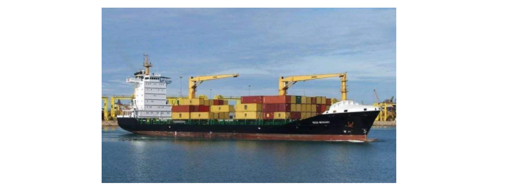
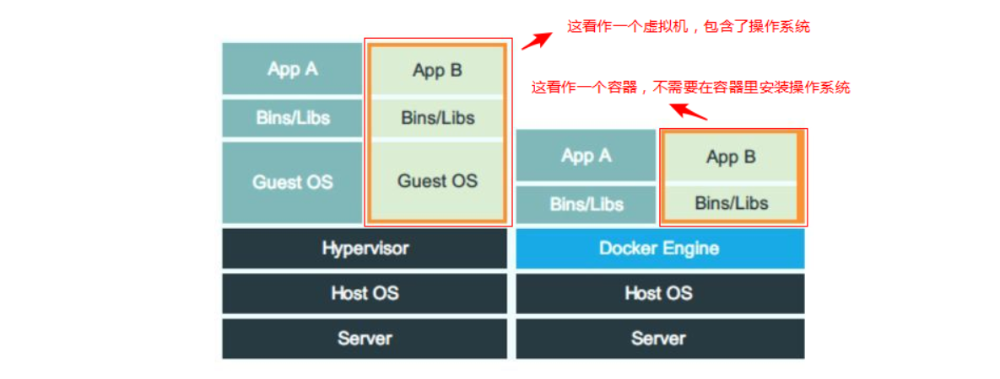
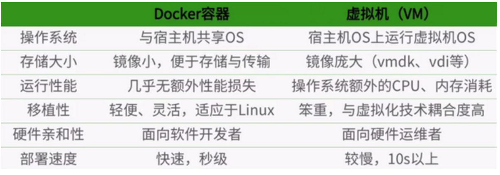
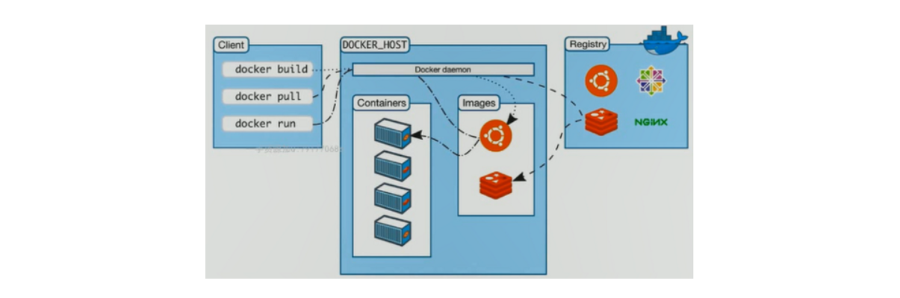
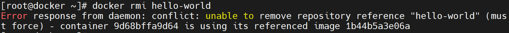

# 02.Docker容器化技术

## 一、认识容器技术

在生活中，瓶子，罐子，盆，试管，缸等都是用来装东西的容器。




在集装箱没有被使用以前，海上运输货物效率不高（货物大小与形状不一)。有了集装箱后，货物可以统一规格来存放与运输了，极大地提高了效率。

在IT技术中:

虚拟化技术可以在宿主机上安装多个不同的操作系统，运行多套不同的应用。但可能就是为了运行一个nginx,却还要在虚拟机里运行一个完整的操作系统,内核和其它无关程序，这种做法资源利用不高。

**所以我们希望更多的关注应用程序本身,而不再分精力去关注操作系统与无关程序,操作系统内核直接与宿主机共享**

Linux容器技术是一种轻量级的虚拟化技术。主要特点有:

1. <span style="color: rgb(216,57,49); background-color: inherit">轻量</span>:只打包了需要的bins/libs(也就是命令和库文件)。与宿主机共享操作系统,直接使用宿主机的内核

2. <span style="color: rgb(216,57,49); background-color: inherit">部署快</span>: 容器的镜像相对虚拟机的镜像小。部署速度非常快，秒级部署

3. <span style="color: rgb(216,57,49); background-color: inherit">移植性好</span>: Build once,Run anywhere(一次构建,随处部署运行)。 build,ship,run

4. <span style="color: rgb(216,57,49); background-color: inherit">资源利用率更高</span>: 相对于虚拟机，不需要安装操作系统，所以几乎没有额外的CPU,内存消耗



面试题：Docker容器 与 传统虚拟化（VM）之间有什么区别？（记住）



Docker应用场景：<span style="color: rgb(216,57,49); background-color: inherit">部署各种各样应用，让我们实现秒级部署、迁移性比较强、性能几乎无额外损失！</span>

## 二、docker介绍


docker就是目前最火热的能实现容器技术的软件,使用go(golang)语言开发。

参考:https://www.docker.com/

## 三、docker软件安装

**docker-ce的yum源下载(任选其一)**

* 下载docker官方ce版（国外服务器）

```powershell
[root@aliyun ~]# wget https://download.docker.com/linux/centos/docker-ce.repo -O /etc/yum.repos.d/docker-ce.repo
```

或者

* 下载aliyun的docker-ce源（中国服务器）

```powershell
[root@aliyun ~]# yum install wget -y
[root@aliyun ~]# wget https://mirrors.aliyun.com/docker-ce/linux/centos/docker-ce.repo -O /etc/yum.repos.d/docker-ce.repo

yum仓库路径：/etc/yum.repos.d/
```

安装docker

```powershell
[root@aliyun ~]# yum install docker-ce -y
```

启动docker

```powershell
[root@aliyun ~]# systemctl start docker
[root@aliyun ~]# systemctl enable docker
```


## 四、镜像,容器,仓库

<span style="color: rgb(216,57,49); background-color: inherit">镜像(image)</span>: 镜像就是打包好的环境与应用。

<span style="color: rgb(216,57,49); background-color: inherit">容器(contanier)</span>: 容器就是运行镜像的实例，镜像看作是静态的,容器是动态的。

<span style="color: rgb(216,57,49); background-color: inherit">仓库(repository)</span>: 存放多个镜像的一个仓库。



## 五、镜像常见操作

### 查看镜像列表（重点）

通过docker images命令查看当前镜像列表; 使用man docker-images得到参数说明

```PowerShell
[root@aliyun ~]# docker images
```

### 搜索镜像（重点）

通过docker search查找官方镜像; 使用man docker-search得到参数说明

```PowerShell
[root@aliyun ~]# docker search centos-stream-9
NAME                               DESCRIPTION                                     STARS     OFFICIAL
dokken/centos-stream-9             CentOS Stream 9 image for use with Test Kitc…   12
eurolinux/centos-stream-9          CentoOS Stream 9 Base Image                     1
cenr/centos-stream-9                                                               0
bhushanj0752/centos-stream-9                                                       0
tomaso/centos-stream-9                                                             0
kmfi/centos-stream-9                                                               0
13822119203/centos-stream-9        mysql、redis、activemq、nginx、http3、openss…   0
centos                             DEPRECATED; The official build of CentOS.       7772      [OK]
nats-streaming                     DEPRECATED; An open-source, high-performance…   167       [OK]
linuxserver/mstream                                                                51
kasmweb/centos-7-desktop           CentOS 7 desktop for Kasm Workspaces            49
lightstreamer                      Lightstreamer is a real-time messaging serve…   94        [OK]
docker/dockerfile-upstream         Staging version of docker/dockerfile            12
rancher/vm-centos                                                                  0
rocm/dev-centos-7                  base ROCm centos 7 dev docker image configur…   3
grafana/drone-downstream           Downstream trigger Drone plugin                 0
kasmweb/core-centos-7              CentOS 7 base image for Kasm Workspaces         7
intel/dlstreamer                   Docker images for Intel® Deep Learning Strea…   4
datadog/centos-i386                                                                0
bellsoft/liberica-openjdk-centos   Liberica is a 100% open-source Java implemen…   4
bellsoft/liberica-openjre-centos   Liberica is a 100% open-source Java implemen…   3
sonatype/centos-rpm                Create RPMs                                     0
vulhub/xstream                                                                     0
corpusops/centos-bare              https://github.com/corpusops/docker-images/     0
starlingx/stx-centos               StarlingX is an open source distributed clou…   0
```

### 拉取镜像（重点）

通过docker pull拉取(下载)镜像; 使用man docker-pull得到参数说明

```PowerShell
此镜像大概200多M，网速要好
[root@aliyun ~]# docker pull dokken/centos-stream-9

[root@aliyun ~]# docker images
REPOSITORY                    TAG            IMAGE ID        CREATED          SIZE
dokken/centos-stream-9       latest         1e1148e4cc2c    13 days ago      202 MB
```

### 删除镜像（重点）

通过docker rmi删除镜像; man docker-rmi查看参数帮助

```PowerShell
[root@aliyun ~]# docker rmi hello-world:latest

注意：rmi两个单词合成，remove移除，image镜像
```

有些情况下，我们删除某个镜像时，可能无法删除，主要原因是因为正在运行的容器或者已经运行的容器在引用的这个镜像，如下图所示



如何解决？答：停止并删除容器，然后在删除镜像

```PowerShell
[root@aliyun ~]# docker ps -a
[root@aliyun ~]# docker rm 9d68bffa9d64（改成自己容器的ID号）
以上容器删除完成后，在删除镜像
[root@aliyun ~]# docker rmi hello-world:latest
```

### 镜像导出（重点）

使用docker save保存(导出)镜像为一个tar文件

```PowerShell
[root@aliyun ~]# docker save dokken/centos-stream-9 -o /root/centos9.tar
```

### 镜像导入（重点）

使用docker load导入

测试时可以将导出的文件scp传输到另一台宿主机测试。或者先删除本地的镜像再导入测试

```PowerShell
[root@aliyun ~]# docker load < /root/centos9.tar
```

### 镜像重命名（重点）

如果导入后看不到名称,可以使用`docker tag`命令改名称

```PowerShell
[root@aliyun ~]# docker images
REPOSITORY          TAG                 IMAGE ID            CREATED           SIZE
<none>              <none>              9f38484d220f        3 months ago      202 MB

[root@aliyun ~]# docker tag 9f38484d220f centos:latest

[root@aliyun ~]# docker images
REPOSITORY          TAG                 IMAGE ID            CREATED          SIZE
  centos           latest              9f38484d220f        3 months ago      202 MB
```

注意：docker tag并不是把镜像复制一份，而是为其创建了一个链接，这个链接指向了原有镜像文件。

如果删除时，会有何影响？

答：

第一个：如果是通过名称 + TAG标签删除，则只删除引用，底层镜像并不会真正删除。

第二个：如果是通过IMAGE ID删除，则会清理所有引用关系，然后删除镜像本身。

## 六、容器常见操作

目标：镜像 =》 运行 =》容器（进行相关操作）

### 查看容器列表

列出所有状态的容器,现在为空列表
使用man docker-ps得到参数说明

### 运行第一个容器

容器大致可以分为两种类型

<span style="color: rgb(216,57,49); background-color: inherit">一次性运行</span>：如hello-world，只运行1次就会自动结束

<span style="color: rgb(216,57,49); background-color: inherit">永久性运行</span>：如nginx、redis、mysql容器，一旦启动后，就会一直运行

运行hello-world容器：

```powershell
[root@aliyun ~]# docker run hello-world
```

再次查看容器列表,多了一个容器,但它的状态是exited，此容器就是运行了一句Hello from Docker!就退出了(我这里容器名随机为silly_lovelace)

```powershell
[root@itheima ~]# docker ps -a
CONTAINER ID        IMAGE               COMMAND             CREATED             STATUS                     PORTS               NAMES
6e3f991b9e8a        hello-world         "/hello"            3 minutes ago       Exited (0) 2 minutes ago                       silly_lovelace
```

### 查看容器运行结果

```PowerShell
后面接容器ID,也可以接容器名称
[root@itheima ~]# docker logs 21086dab3efa
```

> 以上方式除了可以正常查看日志以外，还可以帮我们排查容器故障！

### 停止容器

```PowerShell
[root@itheima ~]# docker stop 21086dab3efa
```

### 启动容器

```PowerShell
[root@itheima ~]# docker start 21086dab3efa
```

### 删除容器

UP状态的容器要先停止才能删除

```PowerShell
[root@itheima ~]# docker stop 21086dab3efa
[root@itheima ~]# docker rm 21086dab3efa
```

在容器运行中，我们还可以通过docker rm -f 容器ID，强制删除某个正在运行的容器

```PowerShell
[root@itheima ~]# docker rm -f 21086dab3efa
```

批量删除所有容器

```PowerShell
加-q参数只查看所有容器的ID
[root@itheima ~]# docker ps -aq
f736fe36002c
21086dab3efa
495310e96d9f
6e3f991b9e8a
停止所有容器
[root@itheima ~]# docker stop $(docker ps -aq)
删除所有容器
[root@itheima ~]# docker rm $(docker ps -aq)
```
