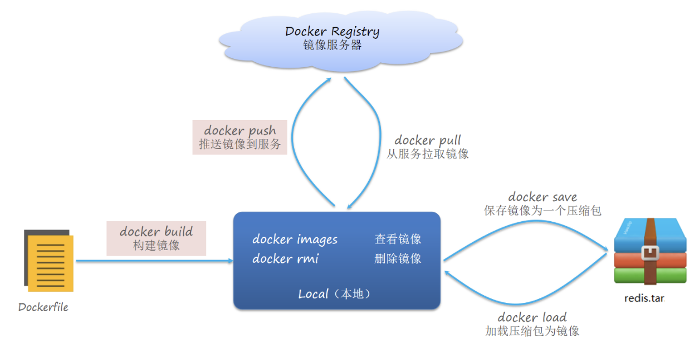
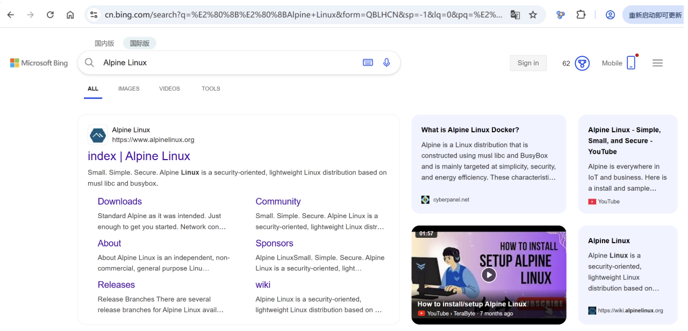
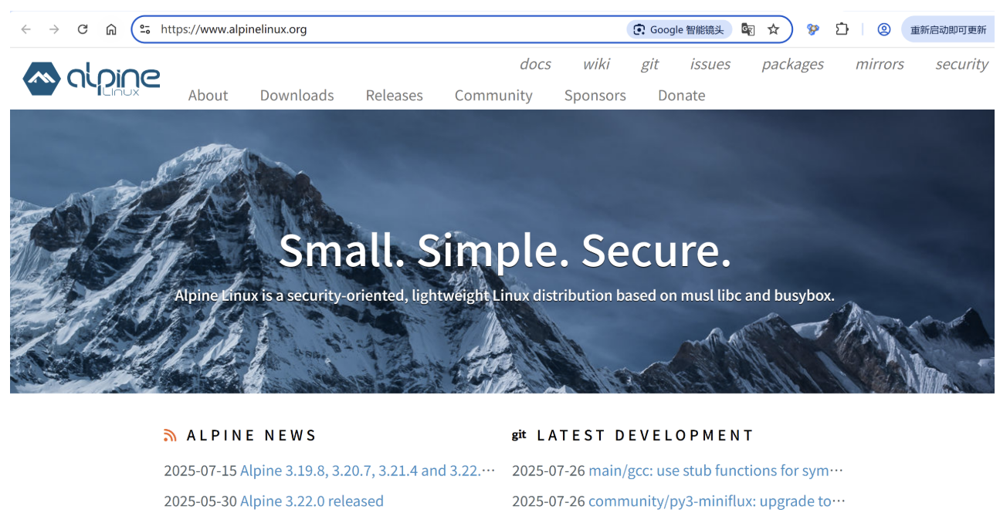

# 03.Dockerfile构建镜像

## 一、Dockerfile概念

Dockerfile 把构建镜像的步骤都写出来，然后按顺序执行，实现自动构建镜像。



Docker 镜像是容器运行的 静态模板，本质是一个 分层的只读文件系统，包含：

1. 基础环境：操作系统层（如 Alpine、Ubuntu）
2. 应用依赖：运行时（Python、Node.js）、库文件
3. 应用代码：编译后的二进制文件或脚本
4. 配置信息：环境变量、启动命令、开放端口等元数据

核心特性：

| 特性     | 说明                                            |
| -------- | ----------------------------------------------- |
| 分层存储 | 每层记录文件变更，共享相同层可节省空间          |
| 不可变性 | 构建后无法修改，需重新构建更新                  |
| 可复用性 | 可推送至仓库（Docker Hub/Harbor）供其他主机使用 |

## 二、Alpine镜像

**Alpine（音，艾尔派因）**镜像是 Docker 生态中**轻量级 Linux 发行版镜像**的代表，以极致精简、高效著称，广泛用于容器化场景。

### 官方地址

https://www.alpinelinux.org/





### **相关特性**

| 特性       | Alpine        | Ubuntu/Debian |
| ---------- | ------------- | ------------- |
| 启动速度   | 0.3秒         | 1.5秒         |
| 内存占用   | <10MB         | >50MB         |
| Shell支持  | ash (BusyBox) | bash          |
| 调试工具   | 需额外安装    | 默认更丰富    |
| 生产采用率 | 容器场景>60%  | 通用场景>70%  |

### **案例说明**

```powershell
# 基于 Alpine 3.18 构建
FROM alpine:3.18

# 更新包索引并安装必要工具（如 curl）
RUN apk update && apk add --no-cache curl

# 运行命令
CMD ["curl", "https://www.baidu.com"]
```

## 三、核心命令

**过去：**

docker安装 => docker pull => docker run => 容器  => 配置操作 => 最终容器 => 导出为最终镜像

**现在：**

docker安装 => dockerfile => 构建最终镜像

| 命令       | 作用                          | 使用示例                                      | 最佳实践                     |
| ---------- | ----------------------------- | --------------------------------------------- | ---------------------------- |
| FROM       | 指定基础镜像                  | FROM ubuntu:22.04                             | 优先选择官方镜像+明确版本号  |
| RUN        | 执行构建命令                  | RUN apt-get update && apt-get install -y curl | 多命令用&&连接，\换行        |
| COPY       | 复制本地文件                  | COPY ./app /usr/src/app                       | 比ADD更透明，优先使用        |
| ADD        | 高级复制 （支持URL/自动解压） | ADD https://example.com/file.tar.gz /         | 仅需解压或远程下载时使用     |
| ENV        | 设置环境变量                  | ENV NODE_ENV=production                       | 敏感变量应在运行时通过-e传入 |
| WORKDIR    | 设置工作目录                  | WORKDIR /app                                  | 替代RUN cd操作               |
| EXPOSE     | 声明监听端口                  | EXPOSE 8080                                   | 实际映射需用-p参数           |
| VOLUME     | 定义数据卷                    | VOLUME ["/data"]                              | 生产环境建议显式挂载         |
| CMD        | 容器启动命令                  | CMD ["python", "[app.py](http://app.py)"]     | 一个Dockerfile只应有一个CMD  |
| ENTRYPOINT | 入口点命令                    | ENTRYPOINT ["nginx", "-g", "daemon off;"]     | 与CMD组合使用                |

**四句真诀：**

一、FROM起基础，WORKDIR定目录              【基础环境】

二、COPY放文件，RUN执行构建命令             【代码准备】 

三、ENV设环境，EXPOSE开端口                【运行配置】

四、CMD启动程序，镜像构建成功               【启动命令】

## 四、使用Dockerfile构建Python镜像

### 目录结构

```powershell
python39-demo/
├── Dockerfile
└── app.py
```

### 编写app.py文件

```python
print("Hello Python 3.9 Docker!")
print("这是一个基于 Dockerfile 构建的 Python 3.9 入门镜像")
```

### 编写Dockerfile

```powershell
# 使用官方 Python 3.9 镜像作为基础镜像
FROM python:3.9

# 设置工作目录
WORKDIR /app

# 将当前目录下的 app.py 复制到容器的 /app 目录
COPY app.py /app/app.py

# 容器启动后执行 Python 程序
CMD ["python", "app.py"]
```

### 构建镜像

```powershell
cd python39-demo
docker build -t python39:v1 .

说明：
docker build        # 构建镜像
-t python39:v1      # 指定镜像名称和版本
.                   # 使用当前目录下的 Dockerfile
```

### 查看镜像

```powershell
docker images
```

### 运行容器

```powershell
docker run --name python39-test python39:v1
```

运行后会看到：

Hello Python 3.9 Docker!
这是一个基于 Dockerfile 构建的 Python 3.9 入门镜像